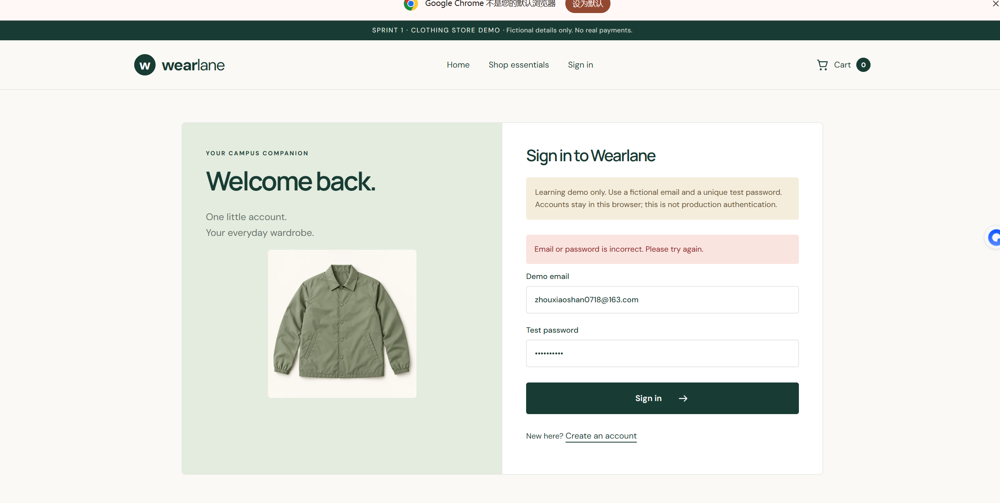
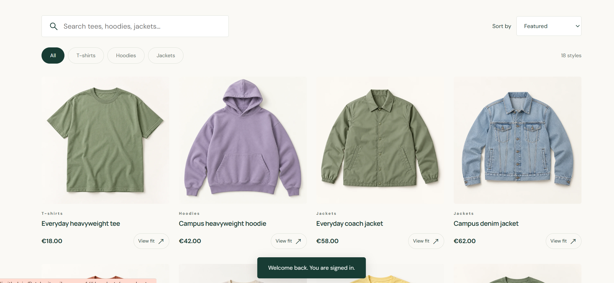
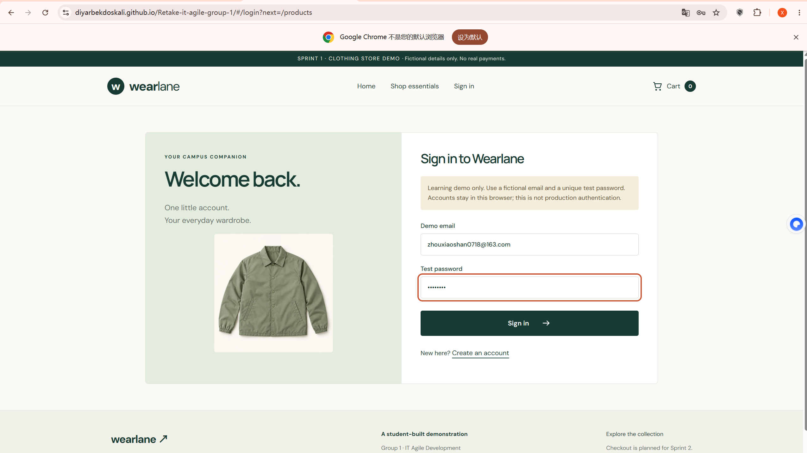
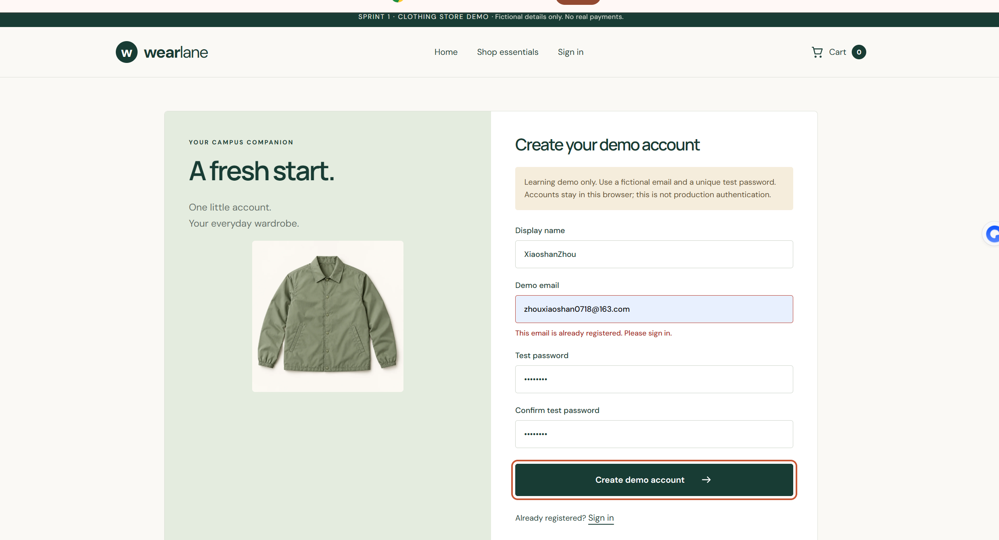
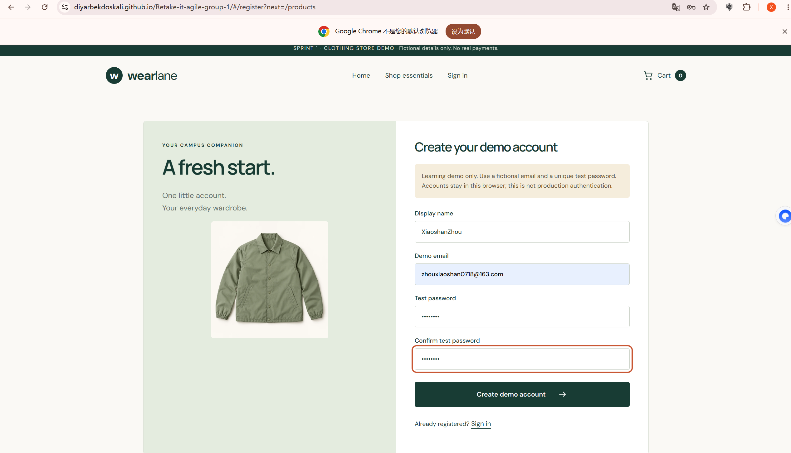

# Wearlane — Registration, Login & Logout Test Results
Site: https://diyarbekdoskali.github.io/Retake-it-agile-group-1/

## Summary
Scope: User registration, login, error handling and logout, related Jira responsibilities. All planned test cases passed, no defects observed.

## Test results
Tested by: Xiaoshan
Date: 2026-10-02
Device/browser: PC Chrome

Feature tested: User registration, login, error handling and logout

Steps performed:
1. Navigate to the website and open registration page
2. Complete registration with valid email and password
3. Attempt to register again using the same registered email
4. Navigate to login page
5. Log in with correct email and password
6. Attempt login with wrong password and non-existing email
7. Click logout button after successful login

Expected result:
1. Valid information: register successfully
2. Duplicate email: show prompt that the email is already registered
3. Correct credentials: login successfully and jump to the correct product page
4. Wrong email or password: pop up corresponding error message
5. Logout: user session ends, return to guest view

Actual result:
1. Registration works normally with valid information.
2. When re-registering with an existing email, the page pops up the reminder that this email has already been registered, and prevents duplicate registration.
3. Logging in with correct credentials successfully enters the product catalogue page, and "Welcome back. You are signed in." prompt appears.
4. Wrong email or password triggers clear red error reminder: "Email or password is incorrect. Please try again."
5. Logout function works properly and returns to guest view.

Result: Pass

Evidence:
- Wearlane_QA_Login_WrongCredential_Error.jpg.png
- Wearlane_QA_Product_List.jpg.png
- Wearlane_QA_Login_Page.jpg.png
- Wearlane_QA_Register_EmailExists.jpg.png
- Wearlane_QA_Register_Empty_Page.jpg.png

Remaining issues: None found

## Evidence review — 3 October 2026

Codex corrected the five image links to match the uploaded filenames. The tester/date/results above remain Xiaoshan's submitted record. [Jira CC-4](https://ue-germany-team-st01y82u.atlassian.net/browse/CC-4).

This report covers accounts, not Product Owner approval. Product Goal, priorities and explicit acceptance/remaining gaps still need a recorded PO/team decision. A blank registration screenshot does not itself demonstrate empty-form validation. Invalid registration inputs and refresh persistence require their own test results before claiming full coverage.
